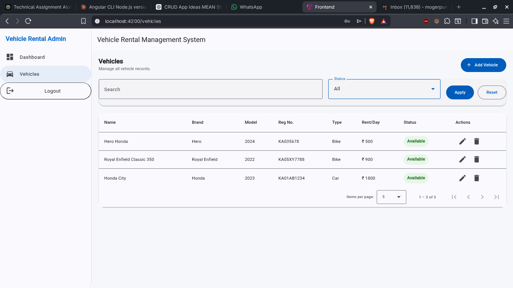

# Vehicle Rental Management System

A full-stack vehicle rental management application with **Node.js + Express + MongoDB** on the backend and **Angular + Angular Material** on the frontend. The current implementation focuses on **admin login** and **vehicle CRUD management**. [file:1]



> Replace `screenshot.png` with your actual image file in the project root, or update the image path if you keep it inside another folder. [file:1]

## Setup Instructions

### 1. Clone the project

```bash
git clone <your-repo-url>
cd vehicle-rental-system
```

### 2. Backend setup

Move to the backend folder and install dependencies.

```bash
cd backend
npm install
```

Create a `.env` file inside `backend/` and add:

```env
PORT=5000
MONGO_URI=your_mongodb_connection_string
JWT_SECRET=your_jwt_secret
```

Run the admin seed script:

```bash
node utils/seedAdmin.js
```

Start the backend server:

```bash
npm run dev
```

### 3. Frontend setup

Open a new terminal and move to the frontend folder.

```bash
cd frontend
npm install
npm install @angular/animations@22.0.6
ng serve
```

Frontend runs on:

```txt
http://localhost:4200
```

Backend runs on:

```txt
http://localhost:5000
```

### 4. Login credentials

After seeding, use:

```txt
Email: admin@example.com
Password: admin123
```

## Features Implemented

### Backend

- Admin login with JWT authentication.
- Protected vehicle routes using auth middleware.
- Vehicle CRUD operations.
- Vehicle search support.
- Vehicle status filtering.
- Pagination support.
- MongoDB models for users and vehicles.

### Frontend

- Admin login page.
- Route protection using Angular auth guard.
- JWT token attachment using HTTP interceptor.
- Admin layout with sidebar and top toolbar.
- Dashboard page.
- Vehicle listing in Angular Material table.
- Add vehicle dialog.
- Edit vehicle dialog.
- Delete confirmation dialog.
- Search, filter, and pagination UI.
- Loading spinner and snackbar messages.

## AI Tools Used

The following AI tools were used during development:

- ChatGPT / Perplexity-style AI assistant for planning, debugging, and code generation.
- AI help for frontend structure, backend fixes, and README drafting.

## Where AI Helped

AI was mainly helpful in these areas:

- Understanding backend requirement changes.
- Fixing import and file naming issues.
- Fixing Mongoose `pre('save')` middleware issue.
- Generating Angular frontend structure.
- Creating Angular standalone components, guard, interceptor, and services.
- Fixing SSR-related `localStorage` issue.
- Fixing Angular Material setup and dependency issues.
- Drafting project documentation.

## What Was Implemented Manually

The following parts were implemented and verified manually during development:

- Set up and organized both backend and frontend project structures.
- Configured the Express backend, MongoDB connection, environment variables, and development workflow.
- Fixed backend import paths, model naming issues, and authentication-related file mismatches.
- Created and tested the admin login flow, including JWT-based protected routes.
- Seeded the initial admin user and verified authentication using Postman.
- Tested all vehicle CRUD APIs manually, including create, fetch, update, delete, search, filter, and pagination flows.
- Integrated the Angular frontend with the backend APIs and verified end-to-end communication.
- Added and structured frontend pages, routing flow, layout behavior, and Angular Material UI integration.
- Verified form handling, dialog interactions, table rendering, delete confirmation, and user feedback states.
- Debugged real project issues such as SSR `localStorage` errors, Angular package version conflicts, SCSS build issues, and component template mismatches.
- Performed local end-to-end testing to ensure login and vehicle management worked correctly from UI to database.

## Challenges Faced

Several practical issues came up during implementation:

- Backend model file naming mismatch (`Users.js` vs `User.js`).
- Mongoose async middleware error: `next is not a function`.
- Need to create a seeded admin user before login could work.
- Angular Material dependency mismatch with Angular version.
- SCSS `@use` placement issue in global styles.
- Template file mix-up between dialog and spinner components.
- Angular SSR issue where `localStorage` was not available on the server side.

These issues were resolved one by one by correcting file structure, package versions, component templates, and SSR-safe browser checks.

## If More Time Was Available

Given more time, the following improvements would be added:

- Vehicle image preview support.
- Better dashboard statistics and charts.
- Form-level validation messages for all fields.
- Toast notifications with better UX.
- Role-based access control.
- Booking module integration.
- Availability calendar.
- Better mobile responsiveness.
- Unit tests and API tests.
- Docker setup for easier project execution.
- Deployment to a cloud platform.

## Submission

This submission includes:

- Backend API for admin authentication and vehicle CRUD.
- Angular frontend for login and vehicle management.
- JWT-protected route handling.
- Search, filter, edit, delete, and pagination support.
- Project README with setup, AI usage, implementation notes, and future improvements.

## Project Structure

```txt
vehicle-rental-system/
├── backend/
├── frontend/
└── README.md
```